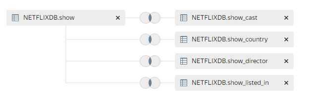

# Netflix Dashboard

[Ссылка на готовый дашборд.](https://datalens.yandex/hwnixkr19na06)

Данные для дашборда взял [здесь.](https://www.kaggle.com/datasets/shivamb/netflix-shows)

Оригинальный CSV файл с даннымии из источника находится в папке
```data```.

Данный файл обработан [этим](./netflix_transform.ipynb) ноутбуком.

Очищенные и преобразованные данные загружены в ClickHouse со следующей схемой:
```
create table show
(
    id              Int32,
    source_show_id  String,
    title           String,
    type            Nullable(String),
    date_added      Nullable(DateTime),
    release_year    Int32,
    rating          Nullable(String),
    description     Nullable(String),
    duration_season Nullable(Int32),
    duration_min    Nullable(Int32)
)
    engine = MergeTree ORDER BY id
        SETTINGS index_granularity = 8192;


create table show_cast
(
    show_id Int32,
    cast    String
)
    engine = MergeTree ORDER BY show_id
        SETTINGS index_granularity = 8192;

create table show_country
(
    show_id Int32,
    country String
)
    engine = MergeTree ORDER BY show_id
        SETTINGS index_granularity = 8192;

create table show_director
(
    show_id  Int32,
    director String
)
    engine = MergeTree ORDER BY show_id
        SETTINGS index_granularity = 8192;

create table show_listed_in
(
    show_id   Int32,
    listed_in String
)
    engine = MergeTree ORDER BY show_id
        SETTINGS index_granularity = 8192;
```

В  итоге получилась вот такая звезда:

